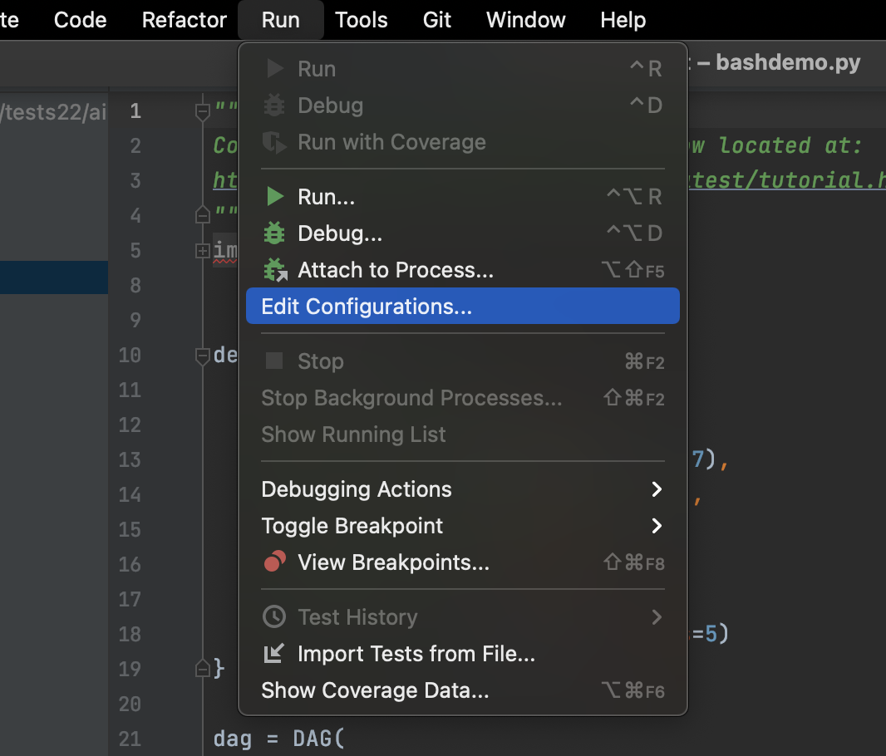
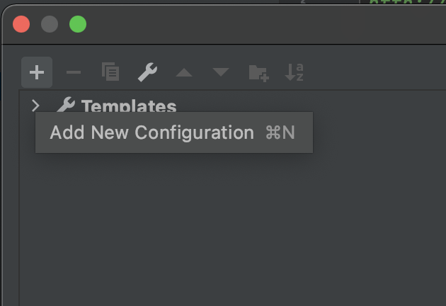
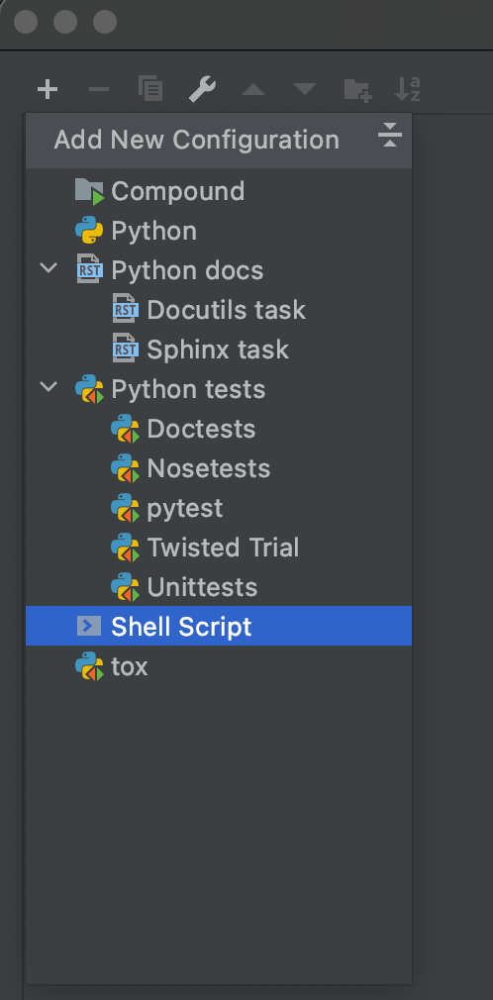
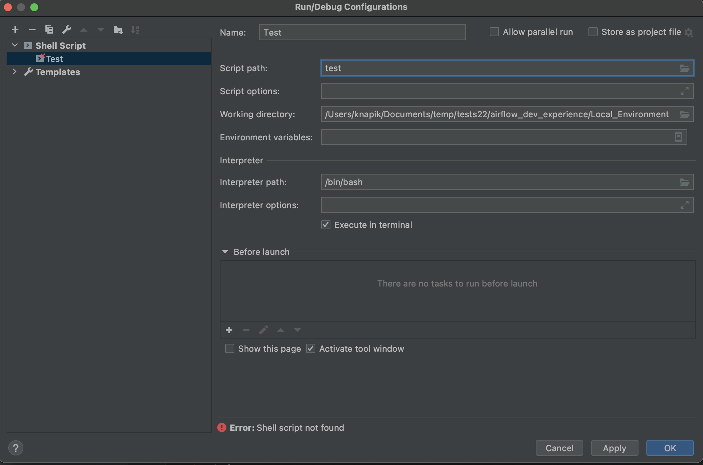
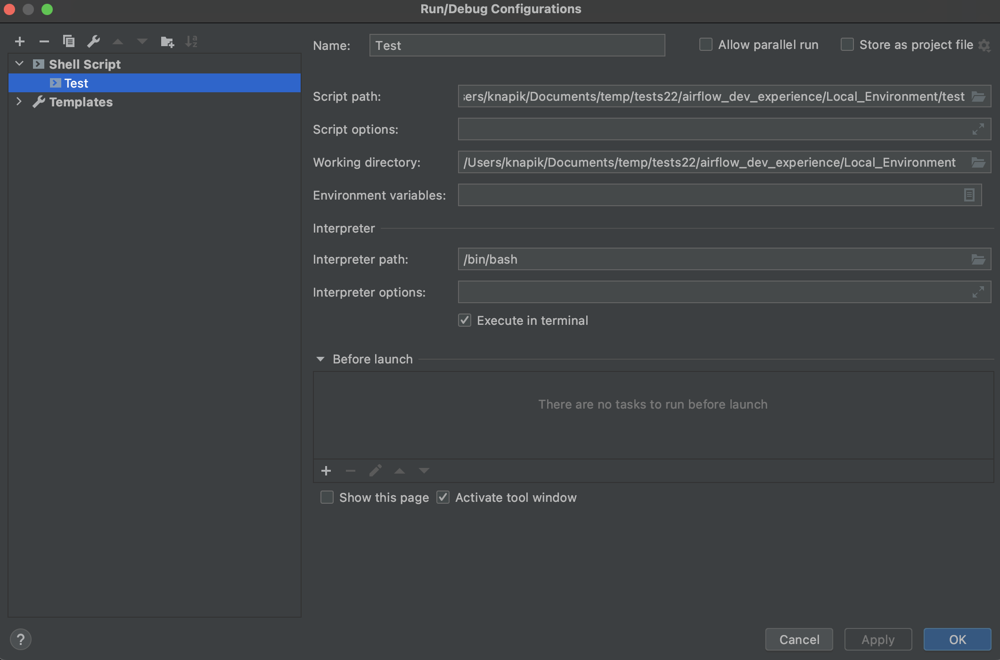
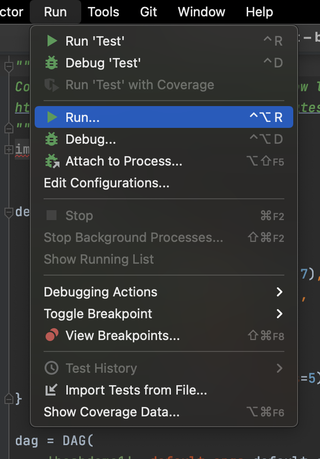
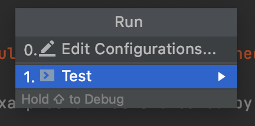

# Local Airflow development environment for Cloud Composer

The model supports:
- Local Airflow instance based on you Cloud Composer staging/test environment. Local Airflow environment uses the same Airflow image and PyPi modules as your Cloud Composer environment
- Local environment provides Airflow Web UI at http://localhost and Airflow CLI through terminal
- Changes to DAGs in a local DAG folder are immediately visible in the local Airflow envrionment (no syncing)
- Support for local Airflow Variables, PyPi modules and Connections
- Built-in DAG tests with easy access through Visual Studio Code and PyCharm
- Built-in authentication to Google Cloud allows local DAG runs with Google Cloud resources (e.g. BigQuery)
- Support for DAG push to the staging Composer environment (although recommended path is through source control)
- Works with Airflow 1.* and 2.*
- The model was created under macOS but should work with other Linux distributions. There is currently no support for Windows. 

## 1. Installation guide
1. If not done yet, install gcloud and select a project (gcloud config set project *myprojectid*) with a Cloud Composer environment that you use for staging/test
2. Identify a local folder you use for your DAGs. Ideally, link it with a source control tool like Cloud Source Repositories (git init and remote push)
3. Create a folder for local Airflow instance (outside of the DAG folder). Enter this folder and run 'git clone https://github.com/filipknapik/airflow_dev_experience'
4. Enter 'airflow_dev_experience/Local_Environment/' folder and run './start'. The first time you run it, you will be asked a few questions. If you want to modify your responses in the future, edit 'config/env.cfg'.

That's it!

Your Airflow environment is now available at [http://localhost:8068](http://localhost:8068). 

## 2.1. Once you install - using the tool with shell scripts
 You may also use: 
  - ./test - tests all your DAGs
  - ./cli - starts a bash session with access to a local Airflow CLI
  - ./senddags - transfers local DAGs to a Composer development environment
  - ./stop - stops local Airflow environment. Doesn't affect your local DAGs
  
 To change settings, edit:
  - Local environment settings (Composer staging env selection, local port etc): config/env.cfg
  - PyPi packages: config/pypi.cfg
  - Airflow variables: config/variables.cfg
  - Connections: config/others.sh
...and run ./start to apply changes

## 2.2. Once you install - using the tool with VS Code
  Open new VS Code window and open 'airflow_dev_experience/Local_Environment' folder that you have cloned. It is important that you open this folder and not its parent or child, as this will activate VS Code plugins. 
  
  All your DAGs are available in the DAGs subfolder as they are linked there from your actual DAG folder. Please feel free to edit your DAGs directly here. 

  VS Code is now configured with few tasks that you may find helpful. To access the tasks, in the top menu click on Terminal->Run Task. Available tasks are: 
  - Test DAGs - tests all your DAGs
  - Restart Airflow environment - restarts the environment after setting changes
  - Terminal access to CLI - starts a bash session with access to a local Airflow CLI
  - Send DAGs to Composer's bucket - transfers local DAGs to a Composer development environment
  - Stop Airflow environment - stops local Airflow environment. Doesn't affect your local DAGs

 To change settings, edit:
  - Local environment settings (Composer staging env selection, local port etc): config/env.cfg
  - PyPi packages: config/pypi.cfg
  - Airflow variables: config/variables.cfg
  - Connections: config/others.sh
...and run 'Restart Airflow environment' task to apply changes

## 2.3. Once you install - using the tool with PyCharm
  There are two ways you can interact with scripts from this package using PyCharm. 
  Option 1 - open terminal window within PyCharm and use shell scripts (e.g. ./test) from point 2.1
  Option 2 - install tasks that you run from within PyCharm. This requires some setup effort but could be more convenient.  

  To set it up click on the following option to edit configurations:
  

  Then add new configuration: 
  

  and use Shell script as type:
  

  Ensure that Local_Environment is a working directory that you cloned:
  

  Copy and paste and local directory to the script path, and then add script name e.g. /test:
  

  To run it, just click on Run:
  

  And then select the task you just created
  

  Repeat the process for other scripts from point 2.1.